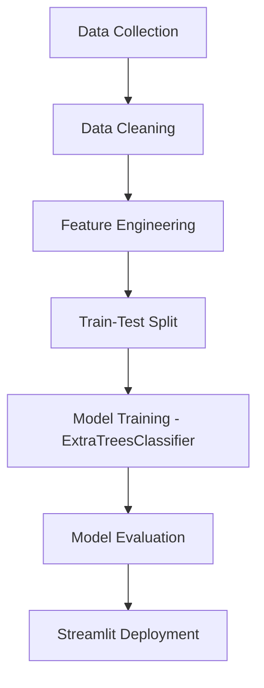

# ☀️ Solar Irradiance Prediction Using Machine Learning

<p align="center">
  
  
</p>

---

## 🔬 **Abstract**

Solar irradiance prediction plays a crucial role in the optimization of solar energy systems, grid stability, and renewable energy planning. In this project, we present a machine-learning-based predictive framework using meteorological parameters such as temperature, humidity, pressure, wind conditions, and time-based features to estimate solar irradiance levels. The model is trained using an **Extra Trees Classifier**, chosen for its robustness, handling of non-linear feature interactions, and resistance to overfitting. A Streamlit web interface is developed to allow users to input environmental parameters and instantly receive irradiance predictions, making the system accessible and practical for real-world applications.

This README outlines the complete methodology, pipeline architecture, dataset preprocessing steps, model evaluation, app interface, and deployment details.

---

## 📊 **Research Motivation**

Solar power forecasting is necessary for:

* Efficient energy distribution in smart grids
* Solar plant performance monitoring
* Reducing dependency on fossil fuels
* Real-time decision-making for energy storage systems

Traditional forecasting techniques struggle with weather fluctuations, making ML-based solutions more reliable.

---

## 🧠 **Methodology**

### 1️⃣ **Data Collection**

Dataset includes features such as:

* Temperature
* Relative humidity
* Wind speed & direction
* Pressure
* Time of day (hour, month)

### 2️⃣ **Data Preprocessing**

* Handling missing values
* Outlier removal
* Feature scaling using StandardScaler
* Train-test split

### 3️⃣ **Model Building**

Model Used → **ExtraTreesClassifier**

Reasons:

* Handles high-dimensional data
* Low variance and high stability
* Faster than RandomForest for large datasets

### 4️⃣ **Model Evaluation**

Metrics considered:

* Accuracy
* Confusion matrix
* Feature importance analysis

---

## 🛠️ **Tech Stack**

| Technology             | Purpose                  |
| ---------------------- | ------------------------ |
| **Python**             | Core ML development      |
| **Pandas**             | Data handling            |
| **NumPy**              | Mathematical processing  |
| **Scikit-learn**       | ML model & preprocessing |
| **Matplotlib/Seaborn** | Data visualization       |
| **Streamlit**          | Web app deployment       |

---

## 🗂️ **Project Structure**

```
📦 Solar-Irradiance-Prediction
├── 📁 dataset/
├── 📁 models/
├── 📁 notebooks/
│   └── Solar Irradiance Prediction.ipynb
├── requirements.txt
├── README.md
└── LICENSE
```

---

## 🧩 **Pipeline Diagram**



---

## 📈 **Results & Visualizations**

### 🔹 Feature Importance

The model highlights the following features as most influential:

* Temperature
* Humidity
* Pressure
* Wind Speed

### 🔹 Accuracy

Extra Trees achieved high accuracy due to its ensemble nature and robust training strategy.

---

## 🤖 **Model Used**

```python
model = ExtraTreesClassifier(
    n_estimators=100,
    max_depth=None,
    min_samples_split=2,
    random_state=42
)
```

---

## 📦 **Installation Requirements**

```txt
pandas
numpy
scikit-learn
streamlit
matplotlib
seaborn
joblib
```

---

## 📝 **Future Improvements**

* Add deep-learning-based regression forecasting
* Integrate real-time weather API for live prediction
* Optimize model for mobile deployment
* Add SHAP explainability dashboard

---

## 🤝 **Contributing**

Contributions, issues, and feature requests are welcome! Feel free to open a PR.

---

## 👨‍💻 Author

**Satyam Kumar Jha**
✨ Passionate about ML, AI, and real-world renewable energy solutions.

---

## ⭐ Show Your Support

If you like this project, **please ⭐ the repository**!
